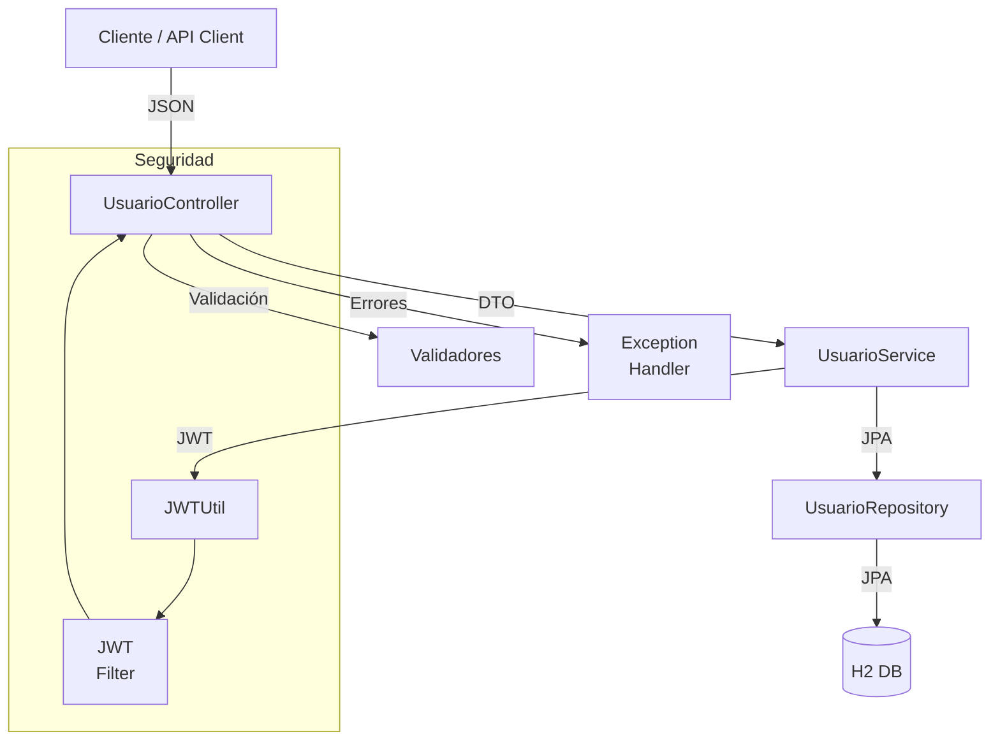
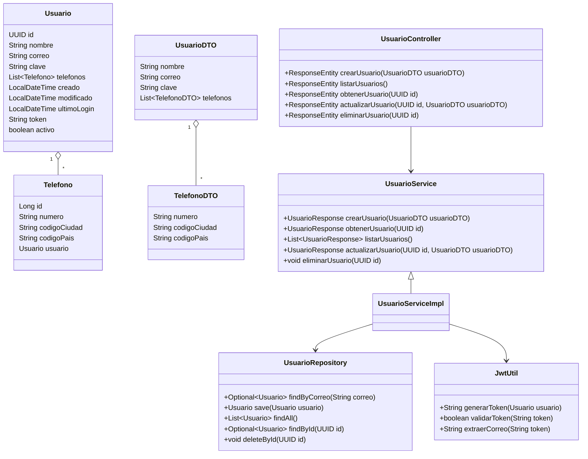
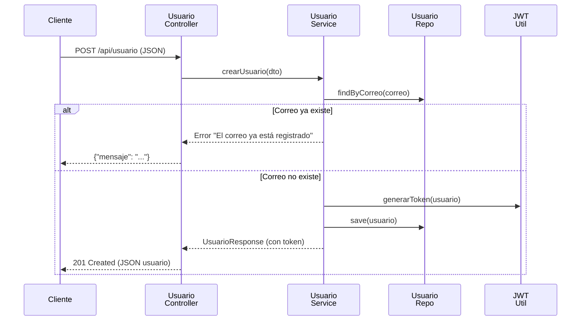

# Evaluación Técnica: API RESTful de Creación de Usuarios

## Descripción

Este proyecto implementa una API RESTful para la gestión de usuarios, desarrollada en **Java 21** con **Spring Boot 3.x**. La solución cumple con los requisitos de la evaluación, incluyendo autenticación JWT, persistencia en base de datos en memoria (H2), validaciones configurables, manejo de errores uniforme y documentación Swagger.

---

## Características principales

- **Endpoints RESTful**: Implementación de los verbos `GET`, `POST`, `PUT`, `PATCH` y `DELETE` para el recurso usuario.
- **Formato JSON**: Todos los endpoints aceptan y retornan únicamente JSON, incluyendo los mensajes de error.
- **Manejo de errores uniforme**: Todos los errores siguen el formato:
  ```json
  {"mensaje": "mensaje de error"}
  ```
- **Validaciones**:
    - El campo **correo** se valida con una expresión regular configurable.
    - El campo **contraseña** se valida con una expresión regular configurable.
    - Si el correo ya existe, retorna error `"El correo ya está registrado"`.
- **JWT**: Al crear un usuario, se genera y persiste un token JWT, que se utiliza para autenticar el resto de los endpoints.
- **Persistencia**: Uso de JPA/Hibernate y base de datos en memoria H2.
- **Swagger**: Documentación interactiva disponible.
- **Pruebas unitarias**: Cobertura de los principales servicios, controladores y lógica de negocio.

---

## Estructura del proyecto

- `src/main/java`: Código fuente de la aplicación.
- `src/main/resources/schema.sql`: Script de creación de tablas.
- `src/main/resources/application.yml`: Configuración de la aplicación, incluyendo expresiones regulares.
- `src/test/java`: Pruebas unitarias.
- `postman/`: Colección y entorno para pruebas con Postman.

---

## Instalación y ejecución

1. **Requisitos previos**
    - Java 21
    - Maven 3.9+

2. **Clonar el repositorio**
   ```sh
   git clone git@github.com:StrawManCL/evaluacion-java-nttdata.git
   cd evaluacion-java-nttdata
   ```

3. **Compilar y ejecutar**
   ```sh
   mvn clean spring-boot:run
   ```

4. **Acceso a la documentación y base de datos**
    - **Swagger UI**: [http://localhost:8080/api/doc.html](http://localhost:8080/api/doc.html)
    - **Consola H2**: [http://localhost:8080/api/h2](http://localhost:8080/api/h2)
        - JDBC URL: `jdbc:h2:mem:usuarios`
        - Usuario: `sa`
        - Contraseña: *(vacío)*

---

## Pruebas de la API

### 1. Crear usuario (POST `/api/usuario`)

**Ejemplo de request:**
```json
{
  "nombre": "Juan Rodriguez",
  "correo": "juan@rodriguez.org",
  "clave": "hunter2",
  "telefono": [
    {
      "numero": "1234567",
      "codigoCiudad": "1",
      "codigoPais": "57"
    }
  ]
}
```

**Respuesta exitosa (`201`):**
```json
{
  "id": "uuid",
  "creado": "2024-06-18T12:34:56Z",
  "modificado": "2024-06-18T12:34:56Z",
  "ultimoLogin": "2024-06-18T12:34:56Z",
  "token": "jwt-token",
  "activo": true
}
```

**Ejemplo de error (`409`):**
```json
{"mensaje": "El correo ya está registrado"}
```

### 2. Listar usuarios (GET `/api/usuario`)

- Requiere autenticación JWT (en header `Authorization: Bearer <token>`).

### 3. Obtener usuario por ID (GET `/api/usuario/{id}`)

- Requiere autenticación JWT.

### 4. Otros endpoints

- Los endpoints `PUT`, `PATCH`, y `DELETE` pueden ser implementados siguiendo la misma estructura y validaciones.

### 5. Pruebas automáticas

Ejecuta las pruebas unitarias con:
```sh
mvn test
```

---

## Pruebas manuales

- Se incluye una colección de Postman en la carpeta `postman/` para probar todos los endpoints.
- Importa el archivo `Usuarios.postman_collection.json` y el entorno `DEV.postman_environment.json` en Postman.
- Sigue el flujo: crear usuario → copiar token → probar endpoints protegidos.

---

## Diagrama de la solución


## Diagrama de clases

## Diagrama de secuencia Creación de usuario

---

## Notas adicionales

- **Configuración de expresiones regulares**: Edita `src/main/resources/application.yml` para modificar las reglas de validación de correo y contraseña.
- **Persistencia**: Los datos se almacenan en memoria y se pierden al reiniciar la aplicación.
- **Swagger**: Permite probar los endpoints y ver los modelos de datos.
- **Manejo de errores**: Todos los errores retornan JSON con el campo `mensaje`.

---

## Autor

Juan Andrés Pardo Rebolledo  

---